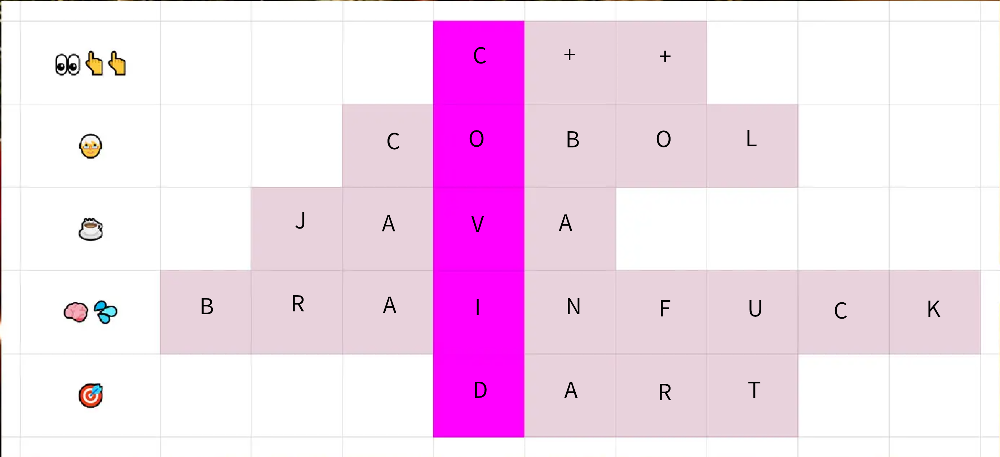

# Oppgave
Hjelpes!

Nå nærmer det seg julebord her i det åpne kontorlandskapet, og sjefs-teknologi-offiser-dama har brukt den siste arbeidsuken på å surre sammen det hun mener er en “ARTIG” konkurranse for alle de ansatte: En programmeringsspråk-rebus.

Artig for alle de ansatte utenom oss mellomledere, tydeligvis, for vi har funnet konkurransen dypt nede i Sharepoint, og skjønner ikke et kvekk av dette, selvfølgelig. Klarer vi ikke dette når gløggen står på bordet, kommer den nå (så langt vi forstår) skyhøye respekten for oss mellomledere til å gå rett i toalettet.

Utviklere, hør vår bønn; kan ikke en konsulent der ute bare gi oss løsningsordet A.S.A.P., så ikke hele mellomleder-bordet blir duste-bordet på julebordet!

Mellomvennlig mellomleder-hilsen,

Patrick von Zwischen,

mellomleder, Bidé konsulting

# Svar

Svar: covid
