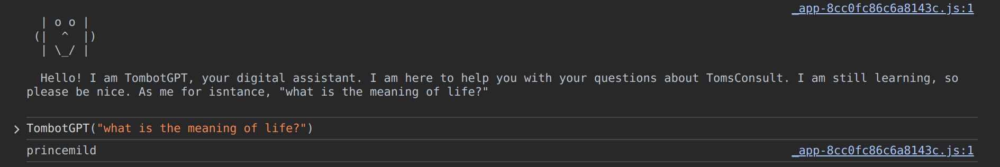

# Oppgave

Hei og hola!
Det er Tom fra Tomsconsulent her, du veit, han som har laga dette rakleverket du mottar oppgaver i. Håper du har tjent masse grunker (og noe gryn) hittil, og her skal du få sjansen til å tjene litt til.

Det har seg nemlig slik at rett før jeg og resten av Porsgrunns-gjengen dro på vår tradisjonelle Granka tur, for å kaste euros på fattige spanjolær i bytte mot litt Cervesas, så bygde jeg støtte for chatbot på Tomsconsult.no.

Ikke noe fancy da, men jeg fikk en e-post fra en Samuel Altmuligmann fra USA som spurte om vi ville teste API-et hans. Så jeg implementerte det jeg. Det var ganske begrensa riktignok, så botten min, TombotGPT tar bare i mot ett spørsmål. Men det er SELVE spørsmålet da.

Problemet er at jeg har helt glemt hva svaret var, og jeg har bare en datamaskin med internet explorer 6 her nede. Forbaska spanjakker. Kunne du hjulpet meg med svaret?

For å snakke med TombotGPT kaller du bare på funksjonen TombotGPT på tomsconsult.no og legger ved spørsmålet ditt.

# Svar

Åpne developer tools for https://www.tomsconsult.no/

```
TombotGPT("what is the meaning of life?")
```

Svar: princemild


