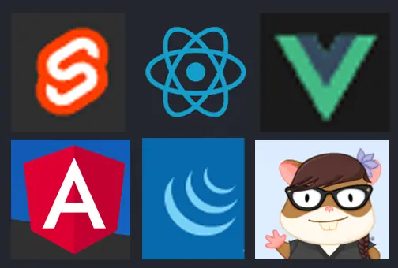

# Oppgave

Kjære deg.

Vi skal utlyse en ledig stilling som juniorutvikler med minst 30 års erfaring innen Svelte-utvikling, doktograd eller høyere i serverless og over 20 års praktisk erfaring med ChatGPT.

Vi jobber med en oppgave å gi søkerne våre for å sjekke at de faktisk veit hva de driver med, som vi trenger hjelp med å teste.

Vi kommer til å gi dem bildet nedenfor, og denne beskrivelsen av oppgaven:

Ta tredje bokstav fra den søteste.
Tredje bokstav fra den hippeste.
Nest siste bokstav fra den kjipeste.
Bokstaven i midten fra den asiatiske.
Siste bokstav fra den vanligste.
Siste bokstav fra den eldste.


 
Og hva får du da? Send oss ordet om du klarer det, så vet vi at vi er inne på noe, her.

Luna Månsen,

rekrutterer og Linkedin-ansvarlig,

Kopp Jemeni AS ☕

# Svar

Jeg viste at "den vanligste" er react, og "den asiatiske" er Vue, så bruteforcet jeg meg frem til ordet.

```
python3 start.py
```

Svar: beauty
