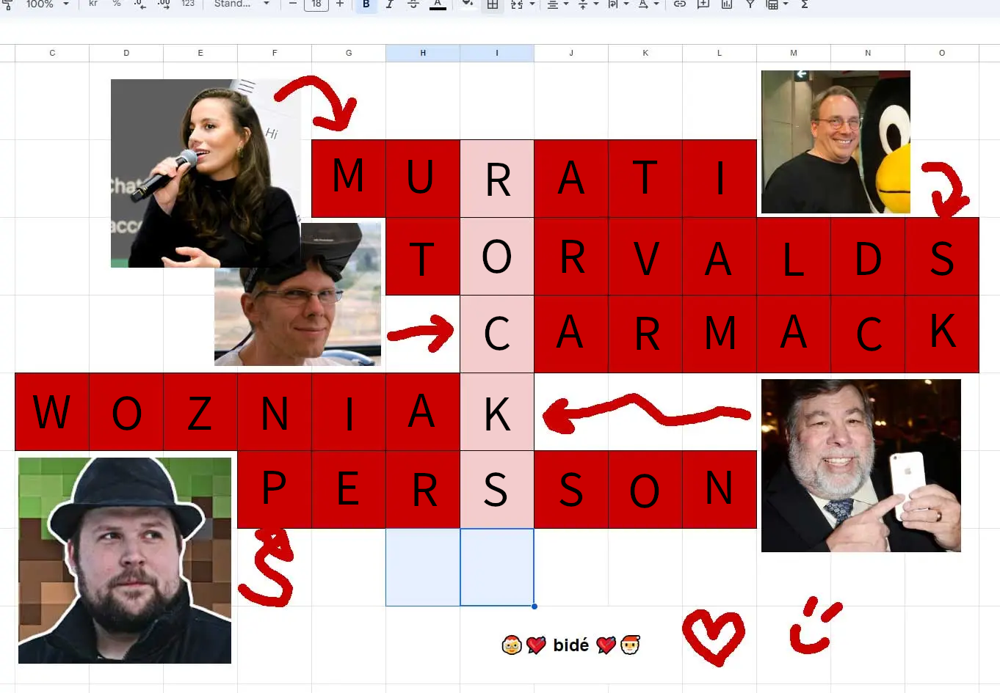

# Oppgave

Hei igjen!

Takk for hjelpa tidligere i julen, med den julebord-rebusgreia de nørdene på kontoret hadde snekra sammen.

Dårlige nyheter: De har gjort det igjen. Denne gangen for juleavslutninga. Jeg tør ikke tenke på hvor mange arbeidstimer som har gått tapt.

Men jeg har ingen planer om å ofre mine svært kostbare mellomleder-arbeidstimer på å løse dette. Så send oss løsningsordet på fem bokstaver pronto ASAP.

Temaet er visstnok tapernørder og AI-CTO-er eller ett eller annet. Snork.

Mellomvennlig mellomleder-hilsen,

Patrick von Zwischen,

mellomleder, Bidé konsulting

# Svar

Svar: rocks
